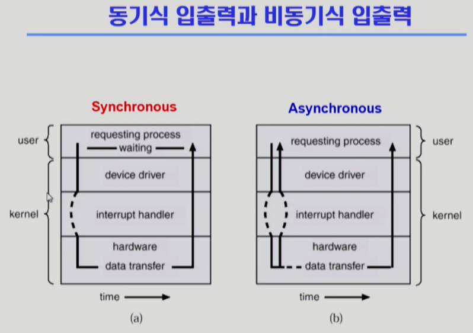

## 3강, 4강

3강
cpu / memory / IO  
memory : cpu의 작업 공간. cpu의 instruction  
cpu : 매 클럭 사이클마다 메모리에서 instruction 하나씩 읽어서 실행  
IO - disk도 io 디바이스  
device controller : io device 마다 붙어서 cpu의 역할  
local buffer : device controller 의 작업 공간(memory 역할)  
register : 메모리 보다 빠름  
mode bit : 실행되는 것이 운영체제인지 사용자 프로그램인지 구분해줌  
interrupt line : io 에게 입력 받기 / 출력받기 / 디스크에서 읽거나 쓰기   
=> io 디바이스 접근  
다음 instruction의 주소 - 실행 - 그 다음 instruction 실행  
cpu는 memory 하고만 일한다.  
device controller 가 일을 하는 동안 cpu가 일 하고 있다.  
timer :특정 프로그램이 cpu 독점하는 것을 막음  
timer 에 세팅한 후에 cpu에 넘겨준다. -> 세팅 된 시간이 되면 interrupt 건다  
cpu는 하나의 일 끝나면 interrupt line 체크  

cpu제어권이 사용자 프로그램으로부터 os로 넘어가도록  

io 해야하면 프로그램이 os한테 넘겨준다. (io 접근은 os에서만 할 수 있다)  
os는 io controller 한테 일을 시킴  
os는 다른 프로그램에게 cpu 넘겨 줌  
io controller가 일 끝나면 cpu에 interrupt 건다  
interrupt 들어오면 권한이 os에게 넘어간다.  
os는 interrupt 확인. 메모리 공간에 일 카피해줌.   
interrupt 당한 애한테 다시 cpu 넘겨줌  

mode bit :   
0-> 모니터 모드. 커널모드. os  
	메모리 접근, i/o 접근 등  
1 -> 사용자 프로그램  
	제한된 instruction  
사용자 프로그램에 넘겨줄 때 mode bit을 1로 변경  
interrupt 로 os 에 넘어가면 mode bit이 0  

타이머  
	특정 프로그램이 독점할 수 없도록  

Device controller : i/o 디바이스 관리하는 일종의 작은 cpu  
 
제어 레지스터  
 
메모리 컨트롤러  

원칙적으로 메모리는 cpu만 접근. buffer에 쌓이면 cpu가 읽고 접근  

cpu가 너무 인터럽트 많이 걸린다 -> 비효율적  
DMA라는 메모리를 하나 더 두고 있다.  
-> 직접 메모리를 컨트롤 할 수 있는 장치  
memory controller : 교통정리. cpu와 DMA 접근을 조절해줌  
DMA가 로컬 버퍼의 내용을 메모리로 복사해줌  

device driver / device controller  
컨트롤러 : 하드웨어  
드라이버 : 소프트웨어  

CPU : pc라는 주소에 있는 instruction 만 실행  

모든 입출력 명령은 특권 명령  
사용자 프로그램은 운영체제에 부탁한다 -> 시스템콜  

i/o 해야한다 -> 프로그램이 CPU에 interrupt 건다 -> mode bit 0 -> cpu가 운영체제에게  
-> 운영체제가 device 에 요청  

소프트웨어 인터럽트 = 트랩  

i/o 요청 -> 소프트웨어 / 다 끝나고 전달 -> 하드웨어 (device controller)  

현대의 운영체제는 인터럽트에 의해 구동됨  

시스템 콜  
사용자 프로그램이 운영체제의 서비스를 받기 위해 호출   

인터럽트  
	인터럽트 벡터 - 각 인터럽트 종류마다 실행해야하는 함수의 주소 정리  
	인터럽트 처리 루틴 - 실제로 인터럽트 처리하는 코드  

cpu : 메모리에 올라와있는 기계어를 읽어와서 동작  
pc : program counter  
instruction 하나 실행하면 pc가 4 증가함  
점프하는 instruction  

cpu : 빠른 일꾼  
인터럽트 마다 처리를 어떻게 해야할지 커널 함수에 담겨있다 (인터럽트 벡터 / 인터럽트 처리 루틴)  

트랩 - 시스템콜 / Exception (오류. ex. 0으로 나누기)  

=================================  

동기식 입출력 / 비동기식 입출력  

synchronous : 시간적으로 맞춤  

i/o 장치까지 가서 뭐가 적혀있는지 직접 확인하고 와서 그 다음 일 실행  
i/o 장치 작업 끝난 다음에야 제어가 사용자 장치에 넘어감  

비동기식 입출력 : 입출력 작업이 끝나기를 기다리지 않고 제어가 사용자 프로그램에 즉시 넘어감  

</img>  


